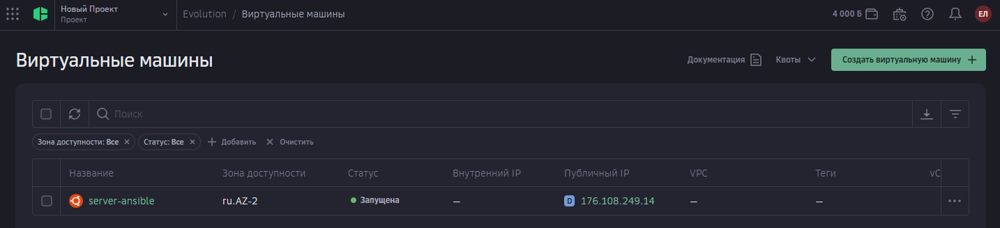
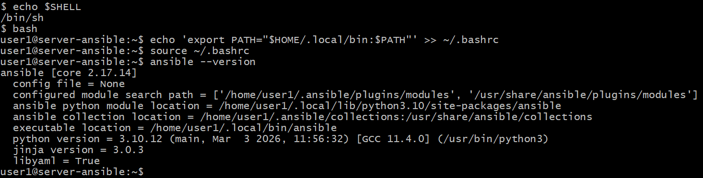
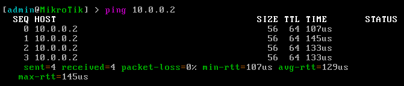
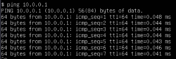

# header
- University: [ITMO University](https://itmo.ru/ru/)
- Faculty: [FICT](https://fict.itmo.ru)
- Course: [Network programming](https://github.com/itmo-ict-faculty/network-programming)
- Year: 2025/2026
- Group: K3321
- Author: Laktionova Elizaveta Artemovna
- Lab: Lab1
- Date of create: 14.05.2026
- Date of finished: 27.05.2026
# Лабораторная работа №1

## Задание

<https://itmo-ict-faculty.github.io/network-programming/education/labs2023_2024/lab1/lab1/>


### Виртуалка в облаке

Я выбрала cloud.ru, взяла бесплатную вм + публичный адрес. Там дают грант на 4000 баллов в течение 2 месяцев.



У меня версия убунту 22.04, я обновила пакеты и установила python, ansible



### Настройка MikroTik CHR

Тут использую VMware Workstation. Настройки:
Тип: Other → Other 64-bit

ОЗУ: 256 MB

Сеть: NAT (т.к. с Bridge были проблемы)

Контроллер: LSI Logic SAS

Тип диска: IDE

После запуска CHR установила пароль для admin, настроила DHCP:

```
/ip dhcp-client add interface=ether1 disabled=no
/ip address print
```

CHR получил IP 192.168.83.135. Winbox подключился по MAC-адресу.

### VPN server

Выбрала настраивать wireguard.

1. Установка и настройка на сервере Ubuntu
```
sudo apt install wireguard -y

echo "net.ipv4.ip_forward=1" | sudo tee -a /etc/sysctl.conf
sudo sysctl -p

cd /etc/wireguard
sudo umask 077
sudo wg genkey | sudo tee privatekey | sudo wg pubkey | sudo tee publickey
```
Конфиг /etc/wireguard/wg0.conf
```
[Interface]
Address = 10.0.0.1/24
ListenPort = 51820
PrivateKey = [приватный_ключ]

PostUp = iptables -A FORWARD -i wg0 -j ACCEPT; iptables -t nat -A POSTROUTING -o enp3s0 -j MASQUERADE
PostDown = iptables -D FORWARD -i wg0 -j ACCEPT; iptables -t nat -D POSTROUTING -o enp3s0 -j MASQUERADE

[Peer]
PublicKey = [публичный_ключ_CHR]
AllowedIPs = 10.0.0.2/32
```
Запуск
```
sudo systemctl enable wg-quick@wg0
sudo systemctl start wg-quick@wg0
sudo wg show
```
2. Настройка клиента на CHR

```
# Создание интерфейса (ключи генерируются автоматически)
/interface wireguard add name=wg1 listen-port=51820

# Назначение IP
/ip address add address=10.0.0.2/24 interface=wg1

# Добавление peer (подключение к серверу)
/interface wireguard peers add interface=wg1 \
    public-key="EaMYdJJT/4kqFE4LqPyavfTRBNiTiyfF8CusEUg0HV8=" \
    endpoint-address=176.108.249.14 \
    endpoint-port=51820 \
    allowed-address=0.0.0.0/0
```

3. Проверяем



Отправим пинг на сервер



Работает!

## Заключение
В результате выполнения лабораторной работы была проведена установка CHR и Ansible, настройка VPN Wireguard.

### Справочные материалы

<https://github.com/tikoci/chr-utm>
