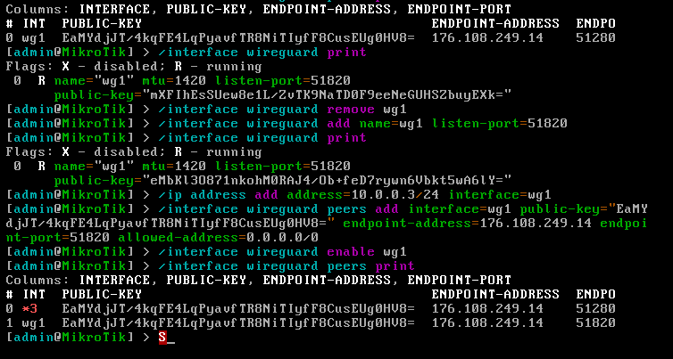
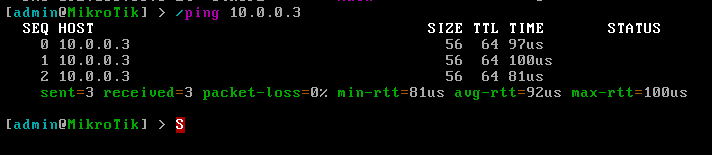

# header
- University: [ITMO University](https://itmo.ru/ru/)
- Faculty: [FICT](https://fict.itmo.ru)
- Course: [Network programming](https://github.com/itmo-ict-faculty/network-programming)
- Year: 2025/2026
- Group: K3321
- Author: Laktionova Elizaveta Artemovna
- Lab: Lab2
- Date of create: 27.05.2026
- Date of finished: 28.05.2026
# Лабораторная работа №2

## Задание

<https://itmo-ict-faculty.github.io/network-programming/education/labs2023_2024/lab2/lab2/>

### Вторая виртуалка

1. Создание второго CHR
Второй CHR был создан путём клонирования первой виртуальной машины в VMware Workstation Pro.

Параметры ВМ:

Имя: MikroTik_CHR2

ОЗУ: 256 MB

Сеть: NAT

Тип диска: IDE

После клонирования был изменён MAC-адрес во избежание конфликтов.



2. Настройка VPN на втором CHR
Для подключения второго CHR к существующему WireGuard-серверу были выполнены следующие команды:

```
# Создание WireGuard интерфейса (ключи генерируются автоматически)
/interface wireguard add name=wg1 listen-port=51820

# Назначение IP-адреса в VPN-сети
/ip address add address=10.0.0.3/24 interface=wg1

# Добавление peer (подключение к серверу)
/interface wireguard peers add interface=wg1 \
    public-key="EaMYdjJT/4kqFE4LqPyavfTR8NiTIyfF8CusEUg0HV8=" \
    endpoint-address=176.108.249.14 \
    endpoint-port=51820 \
    allowed-address=0.0.0.0/0
```

На сервере Ubuntu в файл /etc/wireguard/wg0.conf была добавлена секция для второго CHR:

```
[Peer]
PublicKey = eMbKl30871nkoH0R8A4/0b+feD7rywn6Ubkt5wA6lY=
AllowedIPs = 10.0.0.3/32
```
После перезапуска WireGuard туннель успешно установлен.

### Вывод
В ходе выполнения лабораторной работы был создан второй CHR, который подключён к существующему VPN-туннелю. Была настроена система управления конфигурациями Ansible: созданы файлы инвентаря, групповые и хост-переменные. Написан плейбук для автоматической настройки двух роутеров CHR, включающий:

Создание нового пользователя

Настройку NTP-клиента

Настройку OSPF (instance, area, interface templates)

Сбор информации об устройствах (факты, OSPF соседи, интерфейсы)

Экспорт полных конфигураций в файлы


